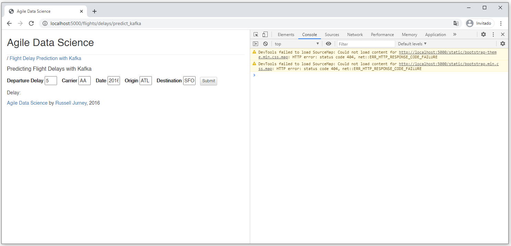
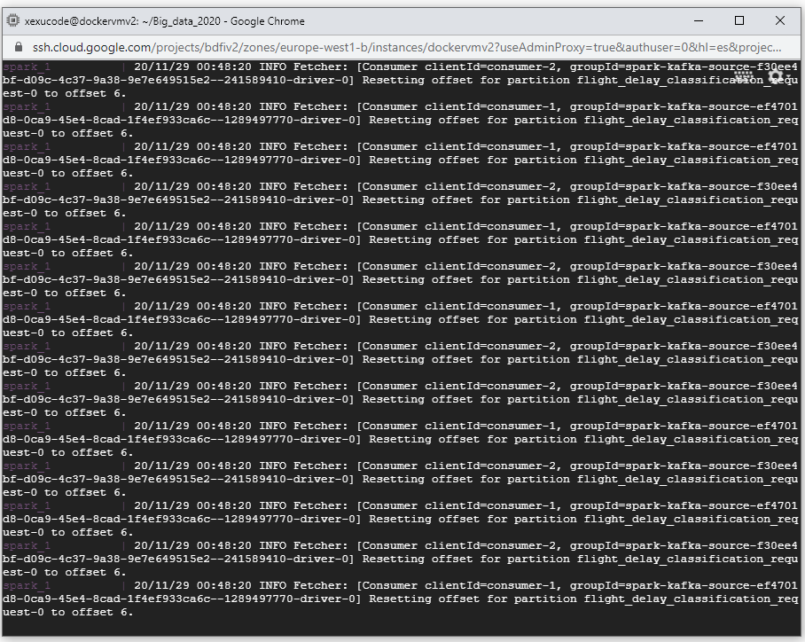
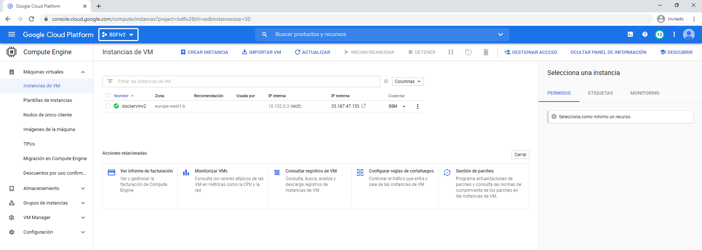

<br/><br/><br/>

# Flight delay prediction
> From a dataset on past flights, we want to predict whether there will be delays in a future flight.

## About The Project

This project integrates several docker services linked through docker-compose. 

Zookeeper and kafka are used to create the topic flight_delay_classification_request. Afterwards, the distance records are imported into MongoDB. Then, the flight predictor is executed using spark-submit. Finally the web application is started with flask.

## Getting Started

If you want to **run the application locally** please proceed with the following steps.


### Prerequisites on W10

The following components are necessary for the execution of the application:
* [Git Bash](https://gitforwindows.org/) (Optionally)
* [Docker Desktop](https://docs.docker.com/docker-for-windows/install/)

_Note: in a similar way it would be in OS and Linux environments_

### Installation

1. Clone this repository.

   ```
   git clone https://github.com/ecalatayudc/Big_data_2020.git
   ```
&nbsp;&nbsp;&nbsp;&nbsp;&nbsp;&nbsp;&nbsp;&nbsp;_Note: you can download the repository as .zip_ 

2. Move to the Big_data_2020/ directory.

   ```sh
   cd Big_data_2020/
   ```
3. Build docker-compose.

   ```sh
   docker-compose build
   ```
4. Run docker-compose up and Compose starts and runs your entire app.

   ```sh
   docker-compose up
   ```
5. Finally visit the following URL to access web application: 
   <br> http://localhost:5000/flights/delays/predict_kafka </br>
  
   **Output:**
   
   
   
   **Output after click on submit:**
   
   
   
## Web Application deployed on Google Cloud - Compute Engine

> You can access through the next link http://35.187.47.153:5000/flights/delays/predict_kafka 

_Note1: Keep in mind this was not configured as a static IP public._
_Note2: It may not work in the future because the application is not running on the server side._

### First step: Set up a new VM instance.

1. Choose a Google Cloud repository.
2. Go to Compute Engine.
3. Enable payment configuration.
4. Create new instance with the desired configuration, we recommend:
   - Choose the preferred region and zone.
   - Machine type: e2-medium (2 vCPU, 4 GB of memory) or higher.
   - Boot disk: OS Ubuntu 18.04 LTS & Standard persistent disk with 30 GB.
   - Allow HTTP and HTTPS traffic.

### Second step: Open VM via SSH and execute the next commands.

   - [Install Docker on Ubuntu 18.04:](https://www.cloudbooklet.com/set-up-docker-on-ubuntu-18-04-lts/)
   
       ```sh
      sudo apt update
      sudo apt install apt-transport-https ca-certificates curl software-properties-common
      curl -fsSL https://download.docker.com/linux/ubuntu/gpg | sudo apt-key add -
      sudo add-apt-repository "deb [arch=amd64] https://download.docker.com/linux/ubuntu bionic stable"
      sudo apt update
      sudo apt-cache policy docker-ce
      sudo apt install docker-ce
      sudo systemctl status docker
      sudo usermod -aG docker username
      ```
      Now restart your SSH or open a new terminal to see the changes.
      
      Some usefull docker commands
      
      ```sh
      docker --version   #To view the version installed.
      docker info       #To view the system information about Docker.
      docker ps         #To view all active containers, use the following command.
      docker ps -a      #To view all containers which are active and inactive, use the below command.
      ```
   - [Install Docker Compose on Ubuntu 18.04:](https://www.cloudbooklet.com/running-docker-compose-with-docker-on-ubuntu-18-04-google-cloud/)
   
       ```sh
      sudo curl -L https://github.com/docker/compose/releases/download/1.23.2/docker-compose-`uname -s`-`uname -m` -o /usr/local/bin/docker-compose
      sudo chmod +x /usr/local/bin/docker-compose
      ```
      Some usefull docker-compose commands
      
        ```sh
      docker-compose --version   #To view the version installed.
      ```
   - Finally, execute the following commands that were previously explained:
   
      ```sh
      git clone https://github.com/ecalatayudc/Big_data_2020.git
      cd Big_data_2020/
      docker-compose up --build
      # If you want to stop the scenario execute 'docker-compose stop'.
      ```
   
      
      
### Last steps: Change Firewall configurations to allow access to Web Application through tcp port 5000 & Enjoy!

Create the IPv4 policy: 

Allow Ingress traffic -> reach as destination 0.0.0.0:5000 through tcp and select a high priority (remind, the policies are applied in top-down mode).


Go to the Dashboard and copy the External IP, in our example is 35.187.47.153 as you can see in the next picture.



**Access to** [http://[EXTERNAL_IP]:5000/flights/delays/predict_kafka](http://[EXTERNAL_IP]:5000/flights/delays/predict_kafka). 


:speech_balloon: You got it, enjoy!

## Contributors

Thanks to:
- [@ecalatayudc](https://github.com/ecalatayudc)
- [@jrodriguezo](https://github.com/jrodriguezo)
